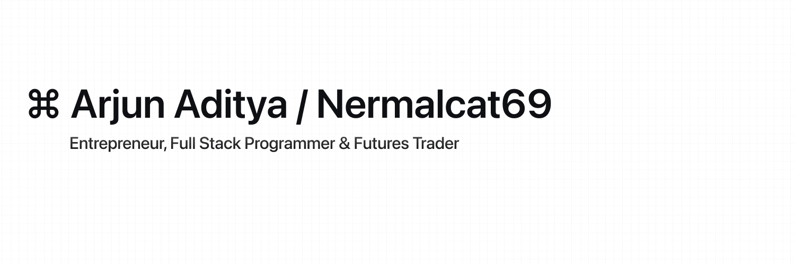

    <a href="https://wakatime.com/@018b8590-08c5-49e9-bd7c-f3a0dcac0016"></a>


 


```Javascript
- My Stack
Typescript
Frontend: React, Next.js, Astro, Svelte and Nuxt (Next.js and Astro is my fav)
Backend: Node.js, Express, Redis Database

- Learning: C, Rust, Golang, Java, Swift, Django
- Tools / Technologies: VsCode, Visual Studio, Xcode, Brackets,
Mongodb, Upstash, Supabase, DigitalOcean  Vercel, Tunnel,

eth: New: 0x3935C4F18bd60465bF178810B565910bA9E74137 | Old: 0xb4F5429b5A25c3959fD1e5967d82c129B828A7a6
sol: 

Let's code, build, and conquer! 🚀
```
  
```Javascript
    _   __                               __              __   _____ ____ 
   / | / /___   _____ ____ ___   ____ _ / /_____ ____ _ / /_ / ___// __ \
  /  |/ // _ \ / ___// __ `__ \ / __ `// // ___// __ `// __// __ \/ /_/ /
 / /|  //  __// /   / / / / / // /_/ // // /__ / /_/ // /_ / /_/ /\__, / 
/_/ |_/ \___//_/   /_/ /_/ /_/ \__,_//_/ \___/ \__,_/ \__/ \____//____/
```

[](https://quine.sh?utm_source=widgets&utm_campaign=nermalcat69)


<!---
https://sr.ht/~nermalcat69/
&apos;
--->
